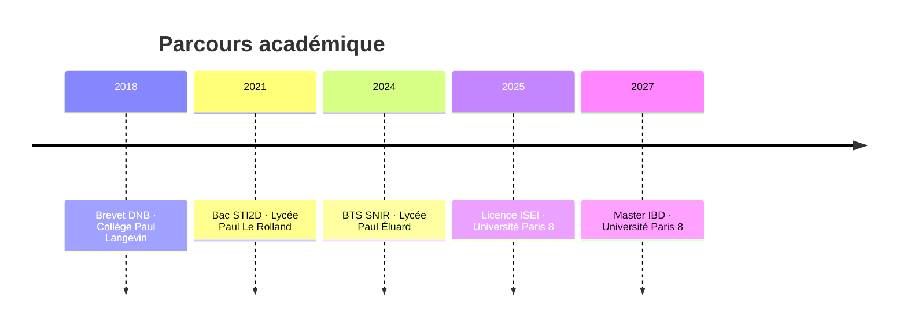

<div align="center">


<p>
<a href="https://www.linkedin.com/in/ansteve"></a>
<a href="https://an-steve.github.io/Portefolio-de-Steve/"></a>
<a href="mailto:antonsteve05@gmail.com"></a>
<a href="https://an-steve.github.io/Portefolio-de-Steve/CV%20ANTON%20NELCON%20Steve-28.pdf"></a>
</p>


</div>

<br>

## 🪞 Un peu de moi

```yaml
moi:
  nom: "ANTON NELCON Steve"
  role: "Étudiant en Master Informatique Big Data & IA"
  ecole: "Université Paris 8"
  localisation: "Paris, Île-de-France 🇫🇷"
  langues: ["Français (C2)", "Anglais (B1)", "Espagnol (A1)", "Tamoul (C2)"]
  actuellement:
    - 🔭 "En Master Informatique Big Data et IA (2025-2027)"
    - 🌱 "Approfondit le Deep Learning et la Data Engineering"
    - 🚀 "Recherche un stage de 3 mois pour 2027"
    - ⚡ "Anime des activités bénévoles au Diocèse de Saint Denis"
  citation: "Transformer la donnée brute en insight, c'est mon moteur."
```

<br>

## 🧬 Mon parcours

<div align="center">



</div>

<br>

## 💼 Expériences

<details open>
<summary><b>🟣 Ingénieur Data & Automatisation IA — Capgemini</b> <i>(Juin – Sept. 2026 · Stage Master 1)</i></summary>
<br>

- Conception de flux d'automatisation via **Microsoft Power Platform** (Power Automate, Power Apps)
- Intégration de solutions d'**IA** pour optimiser les workflows métiers
- Migration de données Excel vers des bases de données sécurisées


</details>

<details>
<summary><b>🟣 Développeur Web & Application — TiqTec</b> <i>(Mai – Juil. 2025 · Licence 3)</i></summary>
<br>

- Site vitrine **WordPress** avec Laragon
- Application Android en **Kotlin**
- Tests et gestion base de données **MySQL**


</details>

<details>
<summary><b>🟣 Développeur Informatique — StreamVision</b> <i>(Mai – Juil. 2023 · BTS)</i></summary>
<br>

- Affichage dynamique pour hôtel — JO Paris 2024
- Interface interactive en **HTML / CSS / JavaScript**
- Compte à rebours animé en JavaScript


</details>

<details>
<summary><b>🟣 Préparateur de commandes — Carrefour Supply Chain</b> <i>(Juil. 2022 – Actuel · Intérim)</i></summary>
<br>

- Préparation de commandes et construction de palettes selon les normes
- **CACES R489** obtenu en juillet 2022

</details>

<details>
<summary><b>🟣 Animateur — Diocèse de Saint Denis</b> <i>(Sept. 2024 – Actuel · Bénévolat)</i></summary>
<br>

- Animation et encadrement d'activités pour enfants
- Organisation d'événements paroissiaux
- Formation *Protéger l'enfance* (MOOCit, juin 2025)

</details>

<br>

## 🚀 Projets qui me représentent

<table>
<tr>
<td width="50%" valign="top">

### 🧠 Reconnaissance d'émotions — CNN
Réseau de neurones convolutif *from scratch* pour classer les émotions faciales, avec analyse fine de la matrice de confusion.

`Python` `TensorFlow` `PyTorch`

[📦 Code](https://github.com/an-Steve/Reseaux-de-Neurones-Convolutif) · [📄 Rapport](https://an-steve.github.io/Portefolio-de-Steve/Impl%C3%A9mentation%20de%20R%C3%A9seaux%20de%20Neurones%20Convolutifs%20(CNN)%20en%20Python-2.pdf)

</td>
<td width="50%" valign="top">

### 🤖 Agent IA
Interface d'agent conversationnel connectée en temps réel, capable de traiter des requêtes complexes.

`IA` `API`

[📦 Code](https://github.com/an-Steve/Agent-IA-) · [🌐 Démo](https://an-steve.github.io/Agent-IA-/)

</td>
</tr>
<tr>
<td width="50%" valign="top">

### 👶 Prédiction de natalité — ML
Random Forest + K-Means sur 187 pays, projections de natalité 1960–2030.

`scikit-learn` `Pandas`

[📦 Code](https://github.com/an-Steve/Natality-IA)

</td>
<td width="50%" valign="top">

### 🌍 Espérance de vie mondiale
Analyse exploratoire de 193 pays (2000–2015), corrélations socio-économiques.

`Tableau` `Excel`

[📦 Code](https://github.com/an-Steve/-Analyse-Mondiale-de-l-Esperance-de-Vie-et-des-Maladies)

</td>
</tr>
<tr>
<td width="50%" valign="top">

### 🍄 Jeu d'arcade Mario 2D/3D
Collisions, audio, double langue, mode clair/sombre.

`Python` `Ursina`

[📦 Code](https://github.com/an-Steve/Jeu-d-arcade-Mario-2D-3D)

</td>
<td width="50%" valign="top">

### 🔐 Authentification sécurisée
Connexion/inscription, sessions, i18n, validation client & serveur.

`PHP` `MySQL`

[📦 Code](https://github.com/an-Steve/Formulaire-dauthenfication-) · [🌐 Démo](https://an-steve.github.io/Formulaire-dauthenfication-/)

</td>
</tr>
</table>

<div align="center">

📁 **[Voir tous mes projets →](https://an-steve.github.io/Portefolio-de-Steve/allprojets.html)**

</div>

<br>

## 📊 Dashboards interactifs
<sub>Visualisations Data réalisées avec HTML, JS & Chart.js</sub>

<div align="center">

| ⚡ Emploi Tech & IA | 🏥 Santé Mondiale | 💹 Économie Mondiale | 🪐 Exoplanètes | ⛅ Météo |
|:---:|:---:|:---:|:---:|:---:|
| [Démo](https://an-steve.github.io/Dashboard-Emploi-Tech-IA/) | [Démo](https://an-steve.github.io/Dashboard-Sante-Mondiale-/) | [Démo](https://an-steve.github.io/Dashboard-Economie-Mondiale/) | [Démo](https://an-steve.github.io/Dashboard-Astronomie/) | [Démo](https://an-steve.github.io/Dashboard-Meteo/) |

</div>

<br>

## 🛠️ Stack technique

<div align="center">

**Web & Mobile**
<br>


**Data Science & IA**
<br>


**Bases de données, systèmes & réseaux**
<br>


**Outils**
<br>


</div>

<br>

## 🏆 Certifications

<div align="center">

| 🎖️ Certification | 🏢 Organisme | 📅 Obtenu |
|---|---|:---:|
| Introduction to Modern AI | Cisco Networking Academy | 2026 |
| Data Analytics Essentials | Cisco Networking Academy | 2026 |
| Introduction to Data Science | Cisco Networking Academy | 2026 |
| Les Bases de Python | Cisco Networking Academy | 2026 |
| SQL avancé | OpenClassrooms | 2026 |
| Maîtrise d'Excel | OpenClassrooms | 2026 |
| Protéger l'enfance | Diocèse de Saint Denis · MOOCit | 2025 |
| PIX | Référentiel DigComp | 2024 |
| CACES R489 | — | 2022 |
| TOEIC | ETS | 2022 |
| Cambridge KET | Cambridge Assessment | 2018 |

</div>

<br>

## 📈 Statistiques GitHub

<div align="center">


</div>

> 💡 *Astuce : ajoute un workflow GitHub Actions "snk" pour animer ton graphique de contributions en serpent qui les mange — un effet très apprécié sur les profils README !*

<br>

## 🎯 Centres d'intérêt

<div align="center">

🙏 **Bénévolat** — Animation d'activités pour enfants&nbsp;&nbsp;|&nbsp;&nbsp;🎮 **Jeux vidéo** — Univers Mario&nbsp;&nbsp;|&nbsp;&nbsp;🎾 **Sport** — Tennis puis badminton en club

</div>

<br>

<div align="center">

*Merci d'avoir parcouru mon profil — n'hésite pas à me contacter !*

<a href="https://www.linkedin.com/in/ansteve"></a>
<a href="https://an-steve.github.io/Portefolio-de-Steve/"></a>
<a href="mailto:antonsteve05@gmail.com"></a>


</div>
